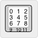
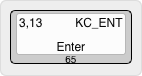

### How to use this tool

*Keyboard File Generator* will attempt to generate some of the more mundane coding when creating an new QMK keyboard.  The tool is designed so that you can visually create your keyboard layout in the [Keyboard Layout Editor](http://www.keyboard-layout-editor.com/), but it does require very specific data in the KLE keys.

The tool supports:
- Key matrix, as per VIA `json` specification
- New VIA rotary encoder support
- RGB Matrix LED keymap index and board LED coordinates

Not supported:
- Keymap keycode mapping.
- ISO Enter keys, *or any other exotic key shapes*

### Format

The format of this data is dependant on the location of the text, and that can be visualized by the following:

*Where:*

* **-0-** The matrix coordinates in the format of `{row},{column}`. e.g. `3,13` = 4th row *(starting at 0)*, 14th column.
* **-2-** The QMK keycode constant, e.g. `KC_ENT` for the Enter key
* **-3-** *The text to show in the image for counter clockwise rotation of the rotary encoder.*
* **-4-** *An "e" character here representing a rotary encoder if appropriate.*
* **-5-** *The text to show in the image for lockwise rotation of the rotary encoder.*
* **-7-** The text to show in the image for the key legend.
* **-10-** The numeric LED number **(starting at 0)**

* all others are ignored

In the above example:
* Key Matrix position is ***Row 3***, ***Col 13*** *(zero offset)*
* Keycode constant is `KC_ENT`
* Text for the image is "***Enter***"
* LED index is ***65*** *(zero offset)*

***Note:***: The tool has very minimal error handling - so if you're doing something wrong it will likely not tell you what it is. Generally, the "garbage in, garbage out" rule applies.
